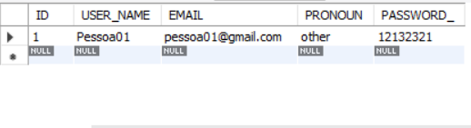

# Formulario de cadastro
 
🧁 Formulário de cadastro com armazenamento de dados.
 
• Desenvolvido com: HTML, CSS, JS, PHP, SQL. 
 
• Ferramentas utilizadas: 
<ul>
 <li>font awesome</li>
 <li>favicon</li>
 <li>GIMP</li>
 <li>color adobe</li>
 <li>figma</li>
</ul>
 
• Resultado:
 

